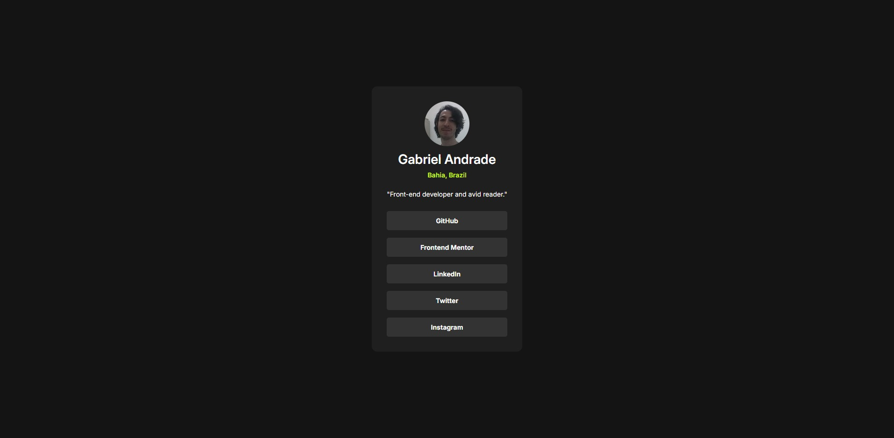

# Frontend Mentor | Social Links Profile
 
## ✨ Overview

### 🖼️ Project Screenshot

### 🔗 Project Links
Solution: [Open](https://www.frontendmentor.io/solutions/html5-css3-grid-google-font-vars-focus-and-aria-for-accessibility-PEbCk27pNZ)

Live Site: [Open](https://elaborate-froyo-32c21a.netlify.app/)

### ✍ My Process

This project is a social links profile card, created as part of a Frontend Mentor challenge. The objective was to design a clean, accessible, and fully responsive profile card that displays social media links while maintaining a visually appealing and structured layout.

#### Technologies & Techniques Used:

- **HTML5:**
    - Implemented semantic elements like `<main>`, `<footer>`,  `<h1>`, and `<ul>` to enhance content structure and improve accessibility.
    - Added meaningful alt attributes to images, ensuring screen readers describe the profile picture correctly.
    - Used aria-label attributes on social media links to provide better descriptions for assistive technologies.

- **CSS3:**
    - Designed the layout using CSS Grid and Flexbox, ensuring proper spacing and alignment.
    - Used CSS variables `:root` to maintain a consistent color scheme and typography, improving maintainability.
    - Applied `:not(:last-child)` selector to efficiently manage spacing between social link items without affecting the last one.
    - Added smooth hover and focus effects to improve user interaction, making links more visually responsive.

- **Accessibility Enhancements:**
    - Ensured proper keyboard navigation by adding a `:focus` outline to links for users who navigate without a mouse.
    - Adjusted color contrast to improve readability, ensuring text remains visible and accessible.
    - Structured social media links within a `<ul>` for better screen reader navigation and a logical reading flow.

- **Responsive Design:**
    - Followed a mobile-first approach, ensuring the card adapts seamlessly across different screen sizes.
    - Set `max-width` constraints to prevent the card from stretching too much on larger screens while keeping the design centered.

## 👨‍💻 Autor

Gabriel Andrade  
[GitHub](https://github.com/4ndradeGabriel)  
[LinkedIn](https://www.linkedin.com/in/andradegabrielw)  

---

Desenvolvido por [Gabriel Andrade](https://github.com/4ndradeGabriel)